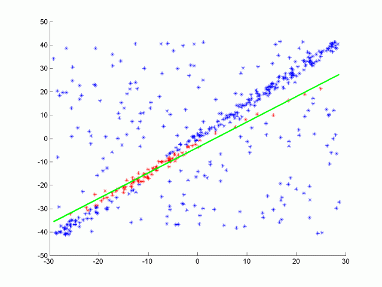

# Project 1: Lidar Obstacle Detection
This repository contains the C++ code developed to detect objects in a point cloud stream.

## Table of Contents
  - [Project Objective](#project-objective)
  - [Detection Pipeline](#detection-pipeline)
    - [RANSAC](#ransac)
    - [KD-Tree](#kd-tree)
    - [Euclidean Clustering](#euclidean-clustering)
    - [Stream Real Point Cloud Data](#stream-real-point-cloud-data)
- [Compiling and Running the Executable](#compiling-and-running-the-executable)
  
## Project Objective
This project aims to detect objects from a point cloud stream of traffic on a street. The baseline code which includes LiDAR streaming, preliminary point cloud segmentation, and clustering, was developed in previous lessons leading up to this project. 

## Detection Pipeline
For this project submission, the following tasks were completed for object detection:
1. Implement RANSAC: used to separate the point cloud between road plane and obstacle plane 
2. Create KD-Tree structure: a quick and efficient search algorithm that searches for groups of points within the point cloud
3. Implement Euclidean clustering: identifies objects from the KD-tree groups and encompasses the groups with a bounding box
4. Stream real point cloud data: detect object in real time in a point cloud stream

### RANSAC
The point cloud is a mass of points consisting of vehicles, street objects, and road. Because we are mainly interested in vehicles and street objects, the road points were be filtered out. Filtering the road points will reduce the data size and make the object detection algorithm run faster and more efficiently. 

Random Sample Consensus (RANSAC) was implemented to segment the road plane from the object plane. RANSAC detects outliers in data by randomly picking a subsample of the data and fits a model through it, such as a line or a plane. Then the iteration with the highest number of inliers or the lowest noise is used as the best model (Figure 1). This idea is used to determine what points are part of the road plane.

<center>
|                           |
|:--:|
|*RANSAC algorithm for line fitting with outliers (Source: Udacity)*|
</center>

RANSAC for a plane was implemented with the following functions in `processPointClouds.cpp`: 
1. `ProcessPointClouds::Ransac3DHelper`: helper function which iteratively picks three points to form a plane. Returns a set of inliers for the plane of best fit if found
2. `ProcessPointClouds::SegmentPlaneRansac`: takes a point cloud and calls `Ransac3DHelper` to process the set of inlier points
3. `ProcessPointClouds::SeperateClouds`: seperates the point cloud from inlier points (road plane) and outlier points (object plane)

After segmenting the point cloud (Figure 2), the object plane is used for object detection.


<figcaption><b>Figure 2: Segmented point cloud with road plane (green points) and object plane (red points)</b></figcaption>
</br>

### KD-Tree
Because the point cloud contains point data with various densities in different locations, implementing a clustering algorithm at this stage would be very slow. To identify clusters and remove areas with sparse points, a KD-Tree method was created to process 3D points.

A `struct` type was created for KD-Tree implementation and can be viewed in `src/custom_functions/kdtree.h`. The following helper functions were created:
- `insert`: inserts 3D points from the point cloud into a binary tree. The tree is split into three main branches based on x, y, and z coordinates of the point
- `search`: returns the IDs of all nodes around a target node based on a user defined distance tolerance

After the object plane point cloud was processed into a KD-Tree, the point cloud is ready for clustering.

### Euclidean Clustering
Euclidean clustering was used to establish indexes to point clusters based on the KD-Tree clusters. The following functions were created to implement Euclidean clustering:
- `euclidenHelper`: uses the `kdtree->search` function to find the nearest points from a target point based on a distance tolerance
- `euclideanCluster`: returns a vector of each cluster's list of point indexes based on the results from `euclidenHelper`
- `ProcessPointClouds::EuclideanClustering`: returns a list of clusters that meet the user defined clustering tolerance

After establishing individual clusters, bounding boxes were added in the point cloud based on the cluster's max width and height (Figure 3). 


<figcaption><b>Figure 3: Bounding boxes on detected objects</b></figcaption>

</br>

### Stream Real Point Cloud Data

After the detection pipeline was finished, the pipeline was appied to a data stream using real point cloud data. The detecton pipeline was able to quickly cluster and detect objects in real time (Figures 4 and 5).


<figcaption><b>Figure 4: Object detection from point cloud stream (3/4th view)</b></figcaption>

</br>

</br>


<figcaption><b>Figure 5: Object detection from point cloud stream (1st person view)</b></figcaption>

</br>


# Compiling and Running the Executable
```shell
cd ~/Project_1_Lidat_Obstacle_Detection
mkdir build && cd build 
cmake ..
make
./environment
```
